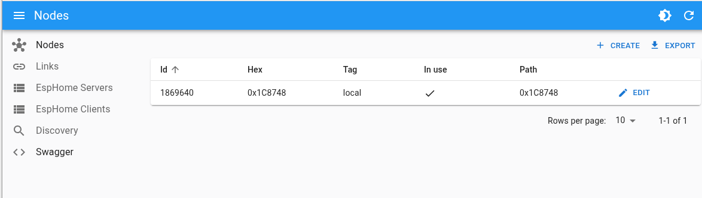

# Fast Getting Started

## BOM: List of Materials

* 2 x **ESP8266** compatible devices (e.g., **WEMOS** D1 MINI) or 2x **ESP32** comaptible devices (e.g. **ESP32 DevKit**).
* 1 x Linux PC (desktop or Raspberry Pi) to run the software

Mark one device as **Coordinator** and one device as **Test Node #1**.

## List of Software

* **Esphome** ESPHome is an open-source firmware framework that simplifies the process of creating custom firmware for popular WiFi-enabled microcontrollers. ([https://github.com/esphome/esphome](https://github.com/esphome/esphome))
* **Meshmeshgo** software HUB for **meshmesh** ([https://github.com/EspMeshMesh/meshmeshgo](https://github.com/EspMeshMesh/meshmeshgo))
* **Docker** container with a running **Home Assistant** instance

## Flashing Node Firmware

### Develop folder 

Create an empty folder for this project, and create and activate an new virtual environment inside it.

```bash
# Create an empty folder called meshmesh
mkdir meshmesh
# Enter inside the new folder
cd meshmesh
# Create a python virtual environment  
python3 -m venv venv
# Activate the newly created environment
source venv/bin/activate
```

### Flash the  coordinator firmware:

Create the following file called **coordinator.yaml** inside the project folder.

> If you have and esp32 device you have have to uncomment the esp32 relative entries and comment out the esp8266 relative entries.

```yaml
external_components:
  - source: github://EspMeshMesh/esphome-meshmesh@main

esphome:
  name: test-coordinator
  friendly_name: Test Coordinator
  comment: Test Coordinator
  project:
    name: EspMeshMesh.MeshMesh Device
    version: 1.0.0

#esp32:
#  board: esp32dev
#  framework:
#    type: esp-idf

esp8266:
  board: d1_mini_lite
  enable_serial: true
  framework:
    version: 3.1.2

logger:
  level: VERBOSE
  baud_rate: 0

api:
  reboot_timeout: 0s

socket:
  #implementation: meshmesh_esp32
  implementation: meshmesh_esp8266

meshmesh:
  baud_rate: 460800
  rx_buffer_size: 2048
  tx_buffer_size: 4096
  password: !secret meshmesh_password
  channel: 3
  node_type: coordinator
  use_starpath: True

switch:
  - platform: gpio
    id: switch_1
    name: Switch
    pin: GPIO2

mdns:
  disabled: True

ping:
  address: server
```

Next connect the coordinator device to the USB port and upload the firmware to this module. 

```bash
esphome run coordinator.yaml --device /dev/ttyUSBX
```

> Replace /dev/ttyUSBX with your real serial device name.

## Test node #1

Create the following file called **testnode1.yaml** inside the project folder.

> If you have and esp32 device you have have to uncomment the esp32 relative entries and comment out the esp8266 relative entries.

```yaml
external_components:
  - source: github://EspMeshMesh/esphome-meshmesh@main

esphome:
  name: test-coordinator
  friendly_name: Test Coordinator
  comment: Test Coordinator
  project:
    name: EspMeshMesh.MeshMesh Device
    version: 1.0.0

#esp32:
#  board: esp32dev
#  framework:
#    type: esp-idf

esp8266:
  board: d1_mini_lite
  enable_serial: true
  framework:
    version: 3.1.2

logger:
  level: VERBOSE
  baud_rate: 0

api:
  reboot_timeout: 0s

socket:
  #implementation: meshmesh_esp32
  implementation: meshmesh_esp8266

meshmesh:
  baud_rate: 460800
  rx_buffer_size: 2048
  tx_buffer_size: 4096
  password: !secret meshmesh_password
  channel: 3
  node_type: coordinator
  use_starpath: True

switch:
  - platform: gpio
    id: switch_1
    name: Switch
    pin: GPIO2

mdns:
  disabled: True

ping:
  address: server
```

Next connect the test node #1 device to the USB port and upload the firmware to this module. 

```bash
esphome run testnode1.yaml --device /dev/ttyUSBX
```

> Replace /dev/ttyUSBX with your real serial device name.

### Finalize

Now you have two devices one will act as coordinator and one will act as test node.
Connect the coordinator device on the PC the will run MeshMeshGo and HomeAssistant and power up the test node #1 device with an external power supply.

## Execute the HUB (meshmeshgo) Instance

### Download the HUB (meshmeshgo) 

The executables can bu found at this page: ([https://github.com/EspMeshMesh/meshmeshgo/releases](https://github.com/EspMeshMesh/meshmeshgo/releases))

Download and uncompress into any new folder or inside the current project folder.

The most important thing to start is to specify the correct serial port name associated with your coordinator device. In Linux, this might be `/dev/ttyUSB0` or `/dev/ttyACM0` or something similar.

Change the config file to adapt to your system:
- SerialPortName: The full path of the serial port connected to the coordinator device. 
- SerialPortBaudRate: The configured baud rate of the coordinator device. 

```json
{
    "WantHelp": false,
    "ConfigFile": "meshmeshgo.json",
    "SerialPortName": "/dev/ttyUSB0",
    "SerialPortBaudRate": 460800,
    "SerialIsEsp8266": true,
    "VerboseLevel": 3,
    "TargetNode": 0,
    "DebugNodeAddr": "",
    "RestBindAddress": ":4040",
    "RpcBindAddress": "",
    "BindAddress": "dynamic",
    "BindPort": 6053,
    "BasePortOffset": 20000,
    "SizeOfPortsPool": 10000
}
```

> Note: If you use an esp8266 as base node connected to the HUB (or coordinator) add set the SerialIsEsp8266 option to true. Otherwise the OTA will not works.


## Execute the HUB

After the HUB has been configured can be executed without arguments.

```bash
./meshmeshgo
```

### Check if is all ok

Connect to [http://localhost:4040](http://localhost:4040). If all goes well, you should see the following page indicating that the coordinator node has been identified and its ID is (in my case NB575B8) (those are the last three bytes of the module MAC address).

 

If you check your current working folder, you can see that a single file called meshmesh.graphml has been created. This file describes your network. For now, there is only a single node.

### Check auto discovery

Power up the test node #1 module. Wait some seconds and go to the dynamic nodes page of the admin GUI: [http://localhost:4040/manager/#/autoNodes](http://localhost:4040/manager/#/autoNodes)


IF you use at least one line with your test-node-1 device in it you are done. The node is working and operational. Now your network consists of two nodes:

## Connect with Home Assistant

The MeshMeshGo HUB support the ZeroConf and mDns protocols. IF your network is not blocking multicast packets you have to find your new device inside HomeAssistant in the auto-detected entities section. 

### Automatic method

Clock on Add button in the test-node-1 section. If your node show-up inside the active HomeAssistant device you are done otherwise you can try the next manual procedure.

### Manual method

Now let's connect the test node to our Home Assistant instance in order to be able to control the blue LED on the board using the esphome API.

First, you have to find the virtual address of the discovered node. This can be found on the meshmeshgo admin site on the servers page: [http://localhost:4040/manager/#/esphomeServers](http://localhost:4040/manager/#/esphomeServers)


You can add the device using the esphome integration in the usual way, using the host and port provided by the HUB admin page.

If this procedure is successful, you will have the new device configured in Home Assistant and you can control the blue LEDs.

> **_Note:_** With the default arguments, the hub will bind different localhost addresses with the same port. This will require you to run the meshmeshgo executable on the same machine as the Home Assistant instance.


